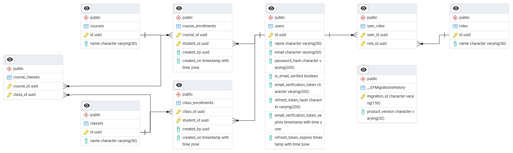

# Course Management App

A course management application for a university that will allow them to create and manage courses, classes and students. 

# Setup Instructions

**Required:** Docker desktop

**Recommended (for ease of use):** Docker desktop, .NET SDK 9.0, Visual studio 2022

## Steps
1. Download the source code as zip and extract it.
2. We have to create a self-signed HTTPS certificate. It can be easily done if you have .NET SDK installed. Open command prompt and navigate inside the solution folder. Perform the following commands:
```
mkdir https_cert
dotnet dev-certs https -ep https_cert\myapp_https_cert.pfx -p my-secret-password-for-https
dotnet dev-certs https --trust
```
3. You can use any other method to generate a self-signed certificate. Whatever the approach, we have to do the following:
    - Create a self-signed HTTPS certificate and trust it. Use 'my-secret-password-for-https' as the secret key to generate the certificate.
    - Export the certificate as 'myapp_https_cert.pfx'.
    - Inside the solution folder, create a new folder named 'https_cert' and move the pfx file inside it.
4. Open docker desktop. Make sure you have an internet connection. Docker desktop should also have network permissions, firewall access, etc.
5. Inside docker desktop, open a terminal. Navigate inside the solution folder. Perform the following command:
```
docker compose up --build
```
6. It will take some time to download the required images, start the containers and make everything ready. You can also open and run the solution using visual studio 2022 for ease of use.
7. Open postman with our API collection ('Course Management App.postman_collection.json' file inside the solution folder). The database has been seeded with the following users. Log in as one of them and test out the APIs
```
User with admin role
---
Email: admin@test.com
Password: abc12345!

User with staff role
---
Email: staff@test.com
Password: abc12345!

User with student role
---
Email: student@test.com
Password: abc12345!
```
8. You can also access the papercut UI at 'http://localhost:5003'. You can open any email the application sends here.
9. You can also access the seq logging UI at 'http://localhost:5004'. You can easily view any log the application generates here.

# Entity-Relation Diagram of Database


# API Documentation

## End-point: Login
Login as a user.

Accessible by everyone
### Method: POST
>```
>https://localhost:8080/api/login
>```
### Body (**raw**)

```json
{
    "Email": "staff@test.com",
    "Password": "abc12345!"
}
```


⁃ ⁃ ⁃ ⁃ ⁃ ⁃ ⁃ ⁃ ⁃ ⁃ ⁃ ⁃ ⁃ ⁃ ⁃ ⁃ ⁃ ⁃ ⁃ ⁃ ⁃ ⁃ ⁃ ⁃ ⁃ ⁃ ⁃ ⁃ ⁃ ⁃ ⁃ ⁃ ⁃ ⁃ ⁃ ⁃ ⁃ ⁃ ⁃ ⁃ ⁃ ⁃ ⁃ ⁃ ⁃ ⁃ ⁃

## End-point: Refresh token
Refreshes access token. Fails if refresh token is expired.

Accessible by everyone
### Method: GET
>```
>https://localhost:8080/api/refresh-token
>```


⁃ ⁃ ⁃ ⁃ ⁃ ⁃ ⁃ ⁃ ⁃ ⁃ ⁃ ⁃ ⁃ ⁃ ⁃ ⁃ ⁃ ⁃ ⁃ ⁃ ⁃ ⁃ ⁃ ⁃ ⁃ ⁃ ⁃ ⁃ ⁃ ⁃ ⁃ ⁃ ⁃ ⁃ ⁃ ⁃ ⁃ ⁃ ⁃ ⁃ ⁃ ⁃ ⁃ ⁃ ⁃ ⁃ ⁃

## End-point: Verify email
Verifies email if verification token is valid and not expired.

Accessible by everyone.
### Method: GET
>```
>https://localhost:8080/api/verify/email?verificationToken=3A2327E7392E94D92AA7B591B0B089E91623E94F9EE088C47B45ECA2FD00B421
>```

### Query Params

|Param|value|
|---|---|
|verificationToken|3A2327E7392E94D92AA7B591B0B089E91623E94F9EE088C47B45ECA2FD00B421|


⁃ ⁃ ⁃ ⁃ ⁃ ⁃ ⁃ ⁃ ⁃ ⁃ ⁃ ⁃ ⁃ ⁃ ⁃ ⁃ ⁃ ⁃ ⁃ ⁃ ⁃ ⁃ ⁃ ⁃ ⁃ ⁃ ⁃ ⁃ ⁃ ⁃ ⁃ ⁃ ⁃ ⁃ ⁃ ⁃ ⁃ ⁃ ⁃ ⁃ ⁃ ⁃ ⁃ ⁃ ⁃ ⁃ ⁃

## End-point: Logout
Logs out user.

Accessible only by a logged in user.
### Method: GET
>```
>https://localhost:8080/api/logout
>```


⁃ ⁃ ⁃ ⁃ ⁃ ⁃ ⁃ ⁃ ⁃ ⁃ ⁃ ⁃ ⁃ ⁃ ⁃ ⁃ ⁃ ⁃ ⁃ ⁃ ⁃ ⁃ ⁃ ⁃ ⁃ ⁃ ⁃ ⁃ ⁃ ⁃ ⁃ ⁃ ⁃ ⁃ ⁃ ⁃ ⁃ ⁃ ⁃ ⁃ ⁃ ⁃ ⁃ ⁃ ⁃ ⁃ ⁃

## End-point: Create student
Creates a student.

Accessible only by admin and staff users.
### Method: POST
>```
>https://localhost:8080/api/student
>```
### Body (**raw**)

```json
{
    "Name": "student2",
    "Email": "student2@test.com",
    "Password": "abc123!!!"
}
```


⁃ ⁃ ⁃ ⁃ ⁃ ⁃ ⁃ ⁃ ⁃ ⁃ ⁃ ⁃ ⁃ ⁃ ⁃ ⁃ ⁃ ⁃ ⁃ ⁃ ⁃ ⁃ ⁃ ⁃ ⁃ ⁃ ⁃ ⁃ ⁃ ⁃ ⁃ ⁃ ⁃ ⁃ ⁃ ⁃ ⁃ ⁃ ⁃ ⁃ ⁃ ⁃ ⁃ ⁃ ⁃ ⁃ ⁃

## End-point: Get student
Gets a student by id.

Accessible only by admin and staff users.
### Method: GET
>```
>https://localhost:8080/api/student/9d978428-ae44-4735-838c-6eaac8abd904
>```

⁃ ⁃ ⁃ ⁃ ⁃ ⁃ ⁃ ⁃ ⁃ ⁃ ⁃ ⁃ ⁃ ⁃ ⁃ ⁃ ⁃ ⁃ ⁃ ⁃ ⁃ ⁃ ⁃ ⁃ ⁃ ⁃ ⁃ ⁃ ⁃ ⁃ ⁃ ⁃ ⁃ ⁃ ⁃ ⁃ ⁃ ⁃ ⁃ ⁃ ⁃ ⁃ ⁃ ⁃ ⁃ ⁃ ⁃

## End-point: Get students
Gets all students.

Accessible only by admin and staff users.
### Method: GET
>```
>https://localhost:8080/api/students
>```

⁃ ⁃ ⁃ ⁃ ⁃ ⁃ ⁃ ⁃ ⁃ ⁃ ⁃ ⁃ ⁃ ⁃ ⁃ ⁃ ⁃ ⁃ ⁃ ⁃ ⁃ ⁃ ⁃ ⁃ ⁃ ⁃ ⁃ ⁃ ⁃ ⁃ ⁃ ⁃ ⁃ ⁃ ⁃ ⁃ ⁃ ⁃ ⁃ ⁃ ⁃ ⁃ ⁃ ⁃ ⁃ ⁃ ⁃

## End-point: Update student
Updates a student.

Accessible only by admin and staff users.
### Method: PUT
>```
>https://localhost:8080/api/student/9d978428-ae44-4735-838c-6eaac8abd904
>```
### Body (**raw**)

```json
{
    "Name": "student2_changed",
    "Email": "student2_changed@test.com",
    "Password": "abc123!!!!!"
}
```


⁃ ⁃ ⁃ ⁃ ⁃ ⁃ ⁃ ⁃ ⁃ ⁃ ⁃ ⁃ ⁃ ⁃ ⁃ ⁃ ⁃ ⁃ ⁃ ⁃ ⁃ ⁃ ⁃ ⁃ ⁃ ⁃ ⁃ ⁃ ⁃ ⁃ ⁃ ⁃ ⁃ ⁃ ⁃ ⁃ ⁃ ⁃ ⁃ ⁃ ⁃ ⁃ ⁃ ⁃ ⁃ ⁃ ⁃

## End-point: Delete student
Deletes a student.

Accessible only by admin and staff users.
### Method: DELETE
>```
>https://localhost:8080/api/student/9d978428-ae44-4735-838c-6eaac8abd904
>```

⁃ ⁃ ⁃ ⁃ ⁃ ⁃ ⁃ ⁃ ⁃ ⁃ ⁃ ⁃ ⁃ ⁃ ⁃ ⁃ ⁃ ⁃ ⁃ ⁃ ⁃ ⁃ ⁃ ⁃ ⁃ ⁃ ⁃ ⁃ ⁃ ⁃ ⁃ ⁃ ⁃ ⁃ ⁃ ⁃ ⁃ ⁃ ⁃ ⁃ ⁃ ⁃ ⁃ ⁃ ⁃ ⁃ ⁃

## End-point: Create class
Creates a class.

Accessible only by admin and staff users.
### Method: POST
>```
>https://localhost:8080/api/class
>```
### Body (**raw**)

```json
{
    "Name": "JavaProgramming"
}
```


⁃ ⁃ ⁃ ⁃ ⁃ ⁃ ⁃ ⁃ ⁃ ⁃ ⁃ ⁃ ⁃ ⁃ ⁃ ⁃ ⁃ ⁃ ⁃ ⁃ ⁃ ⁃ ⁃ ⁃ ⁃ ⁃ ⁃ ⁃ ⁃ ⁃ ⁃ ⁃ ⁃ ⁃ ⁃ ⁃ ⁃ ⁃ ⁃ ⁃ ⁃ ⁃ ⁃ ⁃ ⁃ ⁃ ⁃

## End-point: Get class
Gets a class by id.

Accessible only by admin and staff users.
### Method: GET
>```
>https://localhost:8080/api/class/17685153-ff86-4faf-bd54-9d4536935795
>```


⁃ ⁃ ⁃ ⁃ ⁃ ⁃ ⁃ ⁃ ⁃ ⁃ ⁃ ⁃ ⁃ ⁃ ⁃ ⁃ ⁃ ⁃ ⁃ ⁃ ⁃ ⁃ ⁃ ⁃ ⁃ ⁃ ⁃ ⁃ ⁃ ⁃ ⁃ ⁃ ⁃ ⁃ ⁃ ⁃ ⁃ ⁃ ⁃ ⁃ ⁃ ⁃ ⁃ ⁃ ⁃ ⁃ ⁃

## End-point: Get classes
Gets all classes.

Accessible only by admin and staff users.
### Method: GET
>```
>https://localhost:8080/api/classes
>```


⁃ ⁃ ⁃ ⁃ ⁃ ⁃ ⁃ ⁃ ⁃ ⁃ ⁃ ⁃ ⁃ ⁃ ⁃ ⁃ ⁃ ⁃ ⁃ ⁃ ⁃ ⁃ ⁃ ⁃ ⁃ ⁃ ⁃ ⁃ ⁃ ⁃ ⁃ ⁃ ⁃ ⁃ ⁃ ⁃ ⁃ ⁃ ⁃ ⁃ ⁃ ⁃ ⁃ ⁃ ⁃ ⁃ ⁃

## End-point: Update class
Updates a class.

Accessible only by admin and staff users.
### Method: PUT
>```
>https://localhost:8080/api/class/17685153-ff86-4faf-bd54-9d4536935795
>```
### Body (**raw**)

```json
{
    "Name": "JavaProgrammingChanged"
}
```


⁃ ⁃ ⁃ ⁃ ⁃ ⁃ ⁃ ⁃ ⁃ ⁃ ⁃ ⁃ ⁃ ⁃ ⁃ ⁃ ⁃ ⁃ ⁃ ⁃ ⁃ ⁃ ⁃ ⁃ ⁃ ⁃ ⁃ ⁃ ⁃ ⁃ ⁃ ⁃ ⁃ ⁃ ⁃ ⁃ ⁃ ⁃ ⁃ ⁃ ⁃ ⁃ ⁃ ⁃ ⁃ ⁃ ⁃

## End-point: Delete class
Deletes a class

Accessible only by admin and staff users.
### Method: DELETE
>```
>https://localhost:8080/api/class/17685153-ff86-4faf-bd54-9d4536935795
>```


⁃ ⁃ ⁃ ⁃ ⁃ ⁃ ⁃ ⁃ ⁃ ⁃ ⁃ ⁃ ⁃ ⁃ ⁃ ⁃ ⁃ ⁃ ⁃ ⁃ ⁃ ⁃ ⁃ ⁃ ⁃ ⁃ ⁃ ⁃ ⁃ ⁃ ⁃ ⁃ ⁃ ⁃ ⁃ ⁃ ⁃ ⁃ ⁃ ⁃ ⁃ ⁃ ⁃ ⁃ ⁃ ⁃ ⁃

## End-point: Create course
Creates a course.

Accessible only by admin and staff users.
### Method: POST
>```
>https://localhost:8080/api/course
>```
### Body (**raw**)

```json
{
    "Name": "ComputerScience",
    "ClassIds": [
        "823a6802-98ba-49a9-b42a-91040a07acfb",
        "822eb75d-6713-44c8-a222-24c2c377ea22"
    ]
}
```


⁃ ⁃ ⁃ ⁃ ⁃ ⁃ ⁃ ⁃ ⁃ ⁃ ⁃ ⁃ ⁃ ⁃ ⁃ ⁃ ⁃ ⁃ ⁃ ⁃ ⁃ ⁃ ⁃ ⁃ ⁃ ⁃ ⁃ ⁃ ⁃ ⁃ ⁃ ⁃ ⁃ ⁃ ⁃ ⁃ ⁃ ⁃ ⁃ ⁃ ⁃ ⁃ ⁃ ⁃ ⁃ ⁃ ⁃

## End-point: Get course
Gets a course by id.

Accessible only by admin and staff users.
### Method: GET
>```
>https://localhost:8080/api/course/fb6acc4d-b296-490a-91c7-ced56f95ca65
>```


⁃ ⁃ ⁃ ⁃ ⁃ ⁃ ⁃ ⁃ ⁃ ⁃ ⁃ ⁃ ⁃ ⁃ ⁃ ⁃ ⁃ ⁃ ⁃ ⁃ ⁃ ⁃ ⁃ ⁃ ⁃ ⁃ ⁃ ⁃ ⁃ ⁃ ⁃ ⁃ ⁃ ⁃ ⁃ ⁃ ⁃ ⁃ ⁃ ⁃ ⁃ ⁃ ⁃ ⁃ ⁃ ⁃ ⁃

## End-point: Get courses
Gets all courses.

Accessible only by admin and staff users.
### Method: GET
>```
>https://localhost:8080/api/courses
>```


⁃ ⁃ ⁃ ⁃ ⁃ ⁃ ⁃ ⁃ ⁃ ⁃ ⁃ ⁃ ⁃ ⁃ ⁃ ⁃ ⁃ ⁃ ⁃ ⁃ ⁃ ⁃ ⁃ ⁃ ⁃ ⁃ ⁃ ⁃ ⁃ ⁃ ⁃ ⁃ ⁃ ⁃ ⁃ ⁃ ⁃ ⁃ ⁃ ⁃ ⁃ ⁃ ⁃ ⁃ ⁃ ⁃ ⁃

## End-point: Update course
Updates a course.

Accessible only by admin and staff users.
### Method: PUT
>```
>https://localhost:8080/api/course/fb6acc4d-b296-490a-91c7-ced56f95ca65
>```
### Body (**raw**)

```json
{
    "Name": "ComputerScienceChanged",
    "ClassIds": [
        "823a6802-98ba-49a9-b42a-91040a07acfb",
        "b856a636-4ed0-4eab-964e-ab86a6d1944d"
    ]
}
```


⁃ ⁃ ⁃ ⁃ ⁃ ⁃ ⁃ ⁃ ⁃ ⁃ ⁃ ⁃ ⁃ ⁃ ⁃ ⁃ ⁃ ⁃ ⁃ ⁃ ⁃ ⁃ ⁃ ⁃ ⁃ ⁃ ⁃ ⁃ ⁃ ⁃ ⁃ ⁃ ⁃ ⁃ ⁃ ⁃ ⁃ ⁃ ⁃ ⁃ ⁃ ⁃ ⁃ ⁃ ⁃ ⁃ ⁃

## End-point: Delete course
Deletes a course.

Accessible only by admin and staff users.
### Method: DELETE
>```
>https://localhost:8080/api/course/fb6acc4d-b296-490a-91c7-ced56f95ca65
>```


⁃ ⁃ ⁃ ⁃ ⁃ ⁃ ⁃ ⁃ ⁃ ⁃ ⁃ ⁃ ⁃ ⁃ ⁃ ⁃ ⁃ ⁃ ⁃ ⁃ ⁃ ⁃ ⁃ ⁃ ⁃ ⁃ ⁃ ⁃ ⁃ ⁃ ⁃ ⁃ ⁃ ⁃ ⁃ ⁃ ⁃ ⁃ ⁃ ⁃ ⁃ ⁃ ⁃ ⁃ ⁃ ⁃ ⁃

## End-point: Enroll student in class
Directly enrolls a student in a class.

Accessible only by admin and staff users.
### Method: POST
>```
>https://localhost:8080/api/class/enroll
>```
### Body (**raw**)

```json
{
    "ClassId": "823a6802-98ba-49a9-b42a-91040a07acfb",
    "StudentId": "84197b0a-667e-486d-89d2-b955a1f5da8c"
}
```


⁃ ⁃ ⁃ ⁃ ⁃ ⁃ ⁃ ⁃ ⁃ ⁃ ⁃ ⁃ ⁃ ⁃ ⁃ ⁃ ⁃ ⁃ ⁃ ⁃ ⁃ ⁃ ⁃ ⁃ ⁃ ⁃ ⁃ ⁃ ⁃ ⁃ ⁃ ⁃ ⁃ ⁃ ⁃ ⁃ ⁃ ⁃ ⁃ ⁃ ⁃ ⁃ ⁃ ⁃ ⁃ ⁃ ⁃

## End-point: Enroll student in course
Enrolls a student in a course. Also indirectly enrolls the student in all classes of that course.

Accessible only by admin and staff users.
### Method: POST
>```
>https://localhost:8080/api/course/enroll
>```
### Body (**raw**)

```json
{
    "CourseId": "d2045ced-44a7-43b8-b163-a36aa10796ec",
    "StudentId": "84197b0a-667e-486d-89d2-b955a1f5da8c"
}
```


⁃ ⁃ ⁃ ⁃ ⁃ ⁃ ⁃ ⁃ ⁃ ⁃ ⁃ ⁃ ⁃ ⁃ ⁃ ⁃ ⁃ ⁃ ⁃ ⁃ ⁃ ⁃ ⁃ ⁃ ⁃ ⁃ ⁃ ⁃ ⁃ ⁃ ⁃ ⁃ ⁃ ⁃ ⁃ ⁃ ⁃ ⁃ ⁃ ⁃ ⁃ ⁃ ⁃ ⁃ ⁃ ⁃ ⁃

## End-point: Get students of course
Gets all students enrolled in a course.

Accessible only by admin and staff users.
### Method: GET
>```
>https://localhost:8080/api/course/d5bba856-6190-4579-b219-f0e5599fb698/students
>```


⁃ ⁃ ⁃ ⁃ ⁃ ⁃ ⁃ ⁃ ⁃ ⁃ ⁃ ⁃ ⁃ ⁃ ⁃ ⁃ ⁃ ⁃ ⁃ ⁃ ⁃ ⁃ ⁃ ⁃ ⁃ ⁃ ⁃ ⁃ ⁃ ⁃ ⁃ ⁃ ⁃ ⁃ ⁃ ⁃ ⁃ ⁃ ⁃ ⁃ ⁃ ⁃ ⁃ ⁃ ⁃ ⁃ ⁃

## End-point: Get students of class
Gets all students enrolled in a class. This includes students directly enrolled in that class and also students indirectly enrolled in that class through a course.

Accessible only by admin and staff users.
### Method: GET
>```
>https://localhost:8080/api/class/823a6802-98ba-49a9-b42a-91040a07acfb/students
>```


⁃ ⁃ ⁃ ⁃ ⁃ ⁃ ⁃ ⁃ ⁃ ⁃ ⁃ ⁃ ⁃ ⁃ ⁃ ⁃ ⁃ ⁃ ⁃ ⁃ ⁃ ⁃ ⁃ ⁃ ⁃ ⁃ ⁃ ⁃ ⁃ ⁃ ⁃ ⁃ ⁃ ⁃ ⁃ ⁃ ⁃ ⁃ ⁃ ⁃ ⁃ ⁃ ⁃ ⁃ ⁃ ⁃ ⁃

## End-point: Get classes of course
Gets the classes of a course.

Accessible only by admin and staff users.
### Method: GET
>```
>https://localhost:8080/api/course/d5bba856-6190-4579-b219-f0e5599fb698/classes
>```


⁃ ⁃ ⁃ ⁃ ⁃ ⁃ ⁃ ⁃ ⁃ ⁃ ⁃ ⁃ ⁃ ⁃ ⁃ ⁃ ⁃ ⁃ ⁃ ⁃ ⁃ ⁃ ⁃ ⁃ ⁃ ⁃ ⁃ ⁃ ⁃ ⁃ ⁃ ⁃ ⁃ ⁃ ⁃ ⁃ ⁃ ⁃ ⁃ ⁃ ⁃ ⁃ ⁃ ⁃ ⁃ ⁃ ⁃

## End-point: Get courses of class
Gets the courses that includes the class.

Accessible only by admin and staff users.
### Method: GET
>```
>https://localhost:8080/api/class/822eb75d-6713-44c8-a222-24c2c377ea22/courses
>```

⁃ ⁃ ⁃ ⁃ ⁃ ⁃ ⁃ ⁃ ⁃ ⁃ ⁃ ⁃ ⁃ ⁃ ⁃ ⁃ ⁃ ⁃ ⁃ ⁃ ⁃ ⁃ ⁃ ⁃ ⁃ ⁃ ⁃ ⁃ ⁃ ⁃ ⁃ ⁃ ⁃ ⁃ ⁃ ⁃ ⁃ ⁃ ⁃ ⁃ ⁃ ⁃ ⁃ ⁃ ⁃ ⁃ ⁃

## End-point: Get class enrollment info for student
Gets the class enrollment info for a student. Includes info for both direct enrollment and indirect enrollments through courses.

Accessible only by admin and staff users.
### Method: GET
>```
>https://localhost:8080/api/enrollment-info?classId=823a6802-98ba-49a9-b42a-91040a07acfb&studentId=84197b0a-667e-486d-89d2-b955a1f5da8c
>```

### Query Params

|Param|value|
|---|---|
|classId|823a6802-98ba-49a9-b42a-91040a07acfb|
|studentId|84197b0a-667e-486d-89d2-b955a1f5da8c|


⁃ ⁃ ⁃ ⁃ ⁃ ⁃ ⁃ ⁃ ⁃ ⁃ ⁃ ⁃ ⁃ ⁃ ⁃ ⁃ ⁃ ⁃ ⁃ ⁃ ⁃ ⁃ ⁃ ⁃ ⁃ ⁃ ⁃ ⁃ ⁃ ⁃ ⁃ ⁃ ⁃ ⁃ ⁃ ⁃ ⁃ ⁃ ⁃ ⁃ ⁃ ⁃ ⁃ ⁃ ⁃ ⁃ ⁃

## End-point: Get courses of student
Gets the courses of a logged in student.

Accessible only by a student user.
### Method: GET
>```
>https://localhost:8080/api/my-courses
>```


⁃ ⁃ ⁃ ⁃ ⁃ ⁃ ⁃ ⁃ ⁃ ⁃ ⁃ ⁃ ⁃ ⁃ ⁃ ⁃ ⁃ ⁃ ⁃ ⁃ ⁃ ⁃ ⁃ ⁃ ⁃ ⁃ ⁃ ⁃ ⁃ ⁃ ⁃ ⁃ ⁃ ⁃ ⁃ ⁃ ⁃ ⁃ ⁃ ⁃ ⁃ ⁃ ⁃ ⁃ ⁃ ⁃ ⁃

## End-point: Get classes of student
Gets the classes of a logged in student. Includes both classes that the student is directly enrolled in and classes that the student is indirectly enrolled in through a course.

Accessible only by a student user.
### Method: GET
>```
>https://localhost:8080/api/my-classes
>```


⁃ ⁃ ⁃ ⁃ ⁃ ⁃ ⁃ ⁃ ⁃ ⁃ ⁃ ⁃ ⁃ ⁃ ⁃ ⁃ ⁃ ⁃ ⁃ ⁃ ⁃ ⁃ ⁃ ⁃ ⁃ ⁃ ⁃ ⁃ ⁃ ⁃ ⁃ ⁃ ⁃ ⁃ ⁃ ⁃ ⁃ ⁃ ⁃ ⁃ ⁃ ⁃ ⁃ ⁃ ⁃ ⁃ ⁃

## End-point: Get other student names in class
Gets the names of the other students of a class for a logged in student. The student must be enrolled in that class either directly or indirectly through a course.

Accessible only by a student user.
### Method: GET
>```
>https://localhost:8080/api/class/823a6802-98ba-49a9-b42a-91040a07acfb/other-students
>```

⁃ ⁃ ⁃ ⁃ ⁃ ⁃ ⁃ ⁃ ⁃ ⁃ ⁃ ⁃ ⁃ ⁃ ⁃ ⁃ ⁃ ⁃ ⁃ ⁃ ⁃ ⁃ ⁃ ⁃ ⁃ ⁃ ⁃ ⁃ ⁃ ⁃ ⁃ ⁃ ⁃ ⁃ ⁃ ⁃ ⁃ ⁃ ⁃ ⁃ ⁃ ⁃ ⁃ ⁃ ⁃ ⁃ ⁃
_________________________________________________
Powered By: [postman-to-markdown](https://github.com/bautistaj/postman-to-markdown/)
